SourceTree 是 Git可视化客户端，操作简单，查看commit日志非常方便。

### 下载 
[点此下载](https://www.sourcetreeapp.com/)

### 使用

#### 获取项目代码

**1. 点击克隆/新建**

**2. 在弹出框中输入项目地址，http或者ssh地址都可以**
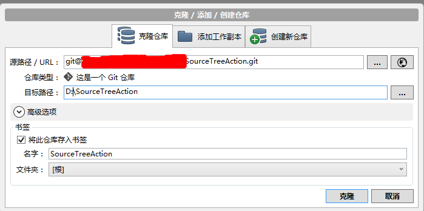

如果箭头指向的仓库类型表明**这不是一个标准的Git仓库**，可能有以下原因:

- 项目地址获取错误
- 没有项目访问权限

**3. 点击“克隆”，等待项目克隆完成，完成后，左侧只有一个分支master**

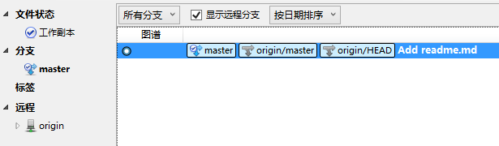

克隆完成后，需要对项目流进行初始化，点击“Git工作流”

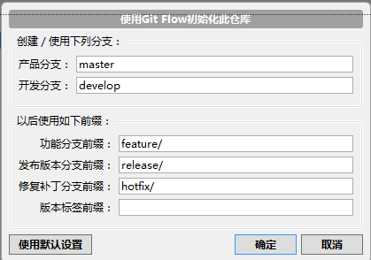

点“确定”，获取develop分支源码

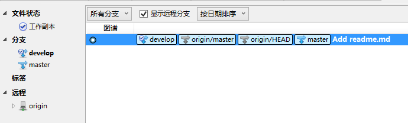

**4. 分支共有5种类型**

- master，最终发布版本，整个项目中有且只有一个
- develop，项目的开发分支，原则上项目中有且只有一个
- feature，功能分支，用于开发一个新的功能
- release，预发布版本，介于develop和master之间的一个版本，主要用于测试
- hotfix，修复补丁，用于修复master上的bug，直接作用于master

**5. 增加新功能**

当开发中需要增加一个新的功能时，可新建feature分支开发，当新功能增加完成后，完成feature分支，将新功能合并到develop中

- 新建feature。首先当前开发分支指向develop，点击“Git工作流”

选择建立新分支

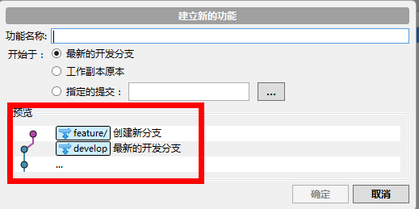

在预览中可看到，feature分支是从develop分出的，输入功能名称，点击确定，项目结构中增加feature分支，并且当前开发分支指向新建的feature分支

在feature分支开发，并提交

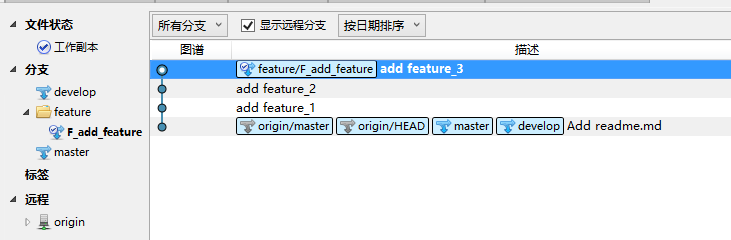

完成feature开发后，将feature中的源码合并到develop分支。将当前分支指向F_add_feature分支，点击“Git工作流”，选择“完成功能”

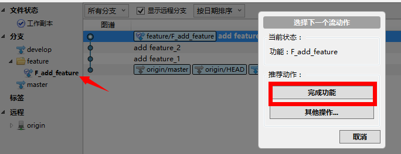

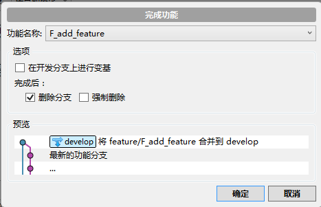

需要再增加新的功能时，重复以上操作即可

当多人协作开发时，可能会出现不同人员对同一文件进行操作，从而引起合并冲突，此时应先解决冲突后再提交

**ps:**

切换分支时，需先提交工作区修改，或使用贮藏（git stash）暂存起来
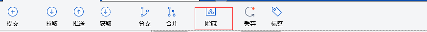

面板详解：

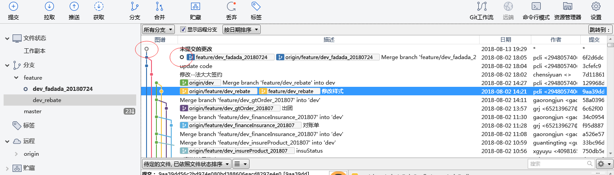

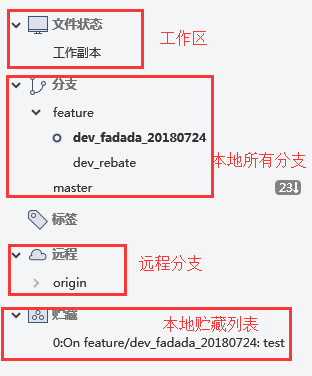

